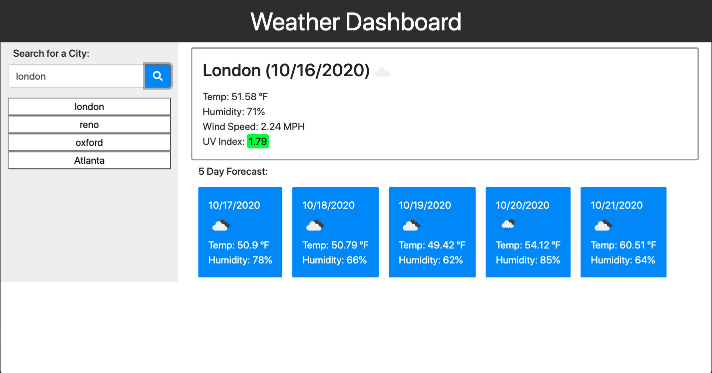

# weaher-dashboard

**Description**

This is a weather app. You can search for a city and get the current weather as well as a five forecast. The users search will be generated into a button that can be clicked and the weather information for that city will be recalled.

**Installation**

Click on the settings tab.
Scroll down to the section that says GitHub Pages.
Click on the link in the green box next to "your site is published at".

Or you can just click here: https://dnfrancis22.github.io/weather-dashboard/

**Usage**

When the page loads type the name of a city into the search field and click the search button. You will be presented with the current weather and a five daily forecast. A button will be generated that is linked to the city you searched for. When that button is clicked the weather information for that city will be recalled. 

**License**

MIT License

Copyright (c) [2020] [Dennis Francis]

Permission is hereby granted, free of charge, to any person obtaining a copy
of this software and associated documentation files (the "Software"), to deal
in the Software without restriction, including without limitation the rights
to use, copy, modify, merge, publish, distribute, sublicense, and/or sell
copies of the Software, and to permit persons to whom the Software is
furnished to do so, subject to the following conditions:

The above copyright notice and this permission notice shall be included in all
copies or substantial portions of the Software.

THE SOFTWARE IS PROVIDED "AS IS", WITHOUT WARRANTY OF ANY KIND, EXPRESS OR
IMPLIED, INCLUDING BUT NOT LIMITED TO THE WARRANTIES OF MERCHANTABILITY,
FITNESS FOR A PARTICULAR PURPOSE AND NONINFRINGEMENT. IN NO EVENT SHALL THE
AUTHORS OR COPYRIGHT HOLDERS BE LIABLE FOR ANY CLAIM, DAMAGES OR OTHER
LIABILITY, WHETHER IN AN ACTION OF CONTRACT, TORT OR OTHERWISE, ARISING FROM,
OUT OF OR IN CONNECTION WITH THE SOFTWARE OR THE USE OR OTHER DEALINGS IN THE
SOFTWARE.
